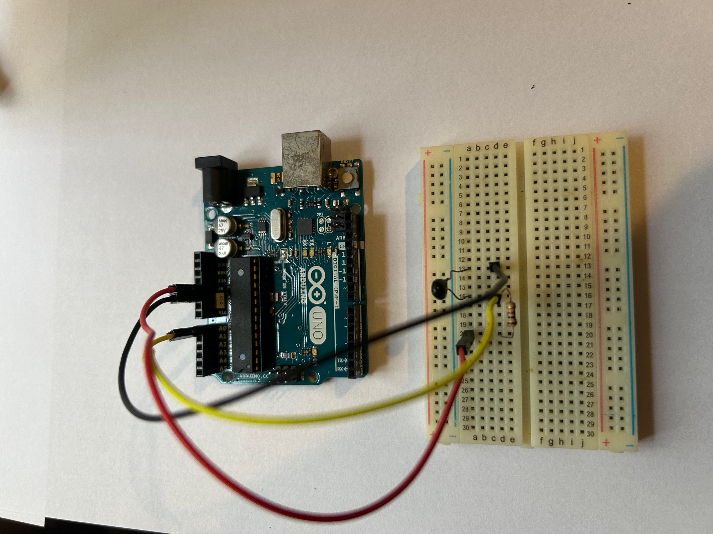

# Embedded systems: Arduino

You need to [install **tinygo**](https://tinygo.org/getting-started/install/) compiler for your platform, and also **avrdude** util to flash your program into Arduino.


You will need: 

1. An **Arduino UNO** board.
2. A breadboard.
3. Some breadboard connectors.
4. A **1k Ohm** resistor (brown, black, red).
5. An **NTC 102 thermistor** (1k Ohm).

This is the code to read the thermistor value, calculate the average of last 5 seconds, and send thru the serial port: 

```go
// tinygo flash -target=arduino -port=/dev/ttyACM0 temperature_ino.go
// tinygo monitor -baudrate=9600
package main

import (
	"machine"
	"time"
)

const (
	adcReadings = 10  // Number of readings to average
	delayMs     = 500 // Delay between readings in milliseconds
)

func main() {

	// Initialize ADC for thermistor
	machine.InitADC()
	thermistor := machine.ADC{Pin: machine.ADC0}
	thermistor.Configure(machine.ADCConfig{})
	var sumADC uint32 = 0
	var count uint8 = 0

	for {
		// Read ADC value from thermistor
		adcValue := thermistor.Get()
		sumADC += uint32(adcValue)
		count++

		if count == adcReadings {
			// Compute average ADC value
			avgADC := sumADC / uint32(count)

			// Send average ADC value over UART
			println(avgADC)

			// Reset sum and count for the next cycle
			sumADC = 0
			count = 0
		}

		// Wait before nexting
		time.Sleep(time.Duration(delayMs) * time.Millisecond)
	}
}
```

Note: Arduino UNO has only 32 KB of flash memory, so you need to reduce the functionality and the packages your code uses. For example, standard `fmt` package is to large for Arduino. Use the builtin functions: `print` and `println`. Also, avoid floating point arithmetics. 

The equivalent `sketch` code is much smaller and can convert temperature inside Arduino: 

```C
#include <math.h>

int TERMISTOR = A0;
float sumTemp = 0;
int count = 0;

void setup() {
  Serial.begin(9600);
}

void loop() {
  int lido = analogRead(TERMISTOR);
  float T0 = 25 + 273.15;
  int RT0 = 1000;
  int B = 3977;
  int VCC = 5;
  int R = 1000;
  float VRT = (5.00 / 1023.00) * lido;
  float VR = VCC - VRT;
  float RT = VRT / (VR / R);
  float ln = log(RT / RT0);
  float TX = (1 / ((ln / B) + (1 / T0)));
  TX = TX - 273.15;
  
  sumTemp += TX;
  count++;

  if(count == 10){
    float averageTemp = sumTemp / count;
    Serial.println(averageTemp);
    // Reset sum and count for the next cycle
    sumTemp = 0;
    count = 0;
  }

  delay(500);
}
```

## Running the sample

To compile and flash your code into Arduino, you need to run this command: 

```shell
tinygo flash -target=arduino -port=/dev/ttyACM0 temperature_ino.go
```

In order to do that, you need to know which port is your Arduino connected. Normally is `/dev/ttyACM0`. To know that you can use `lsusb` command:

```shell
lsusb
Bus 001 Device 001: ID 1d6b:0002 Linux Foundation 2.0 root hub
Bus 001 Device 031: ID 1a40:0101 Terminus Technology Inc. Hub
Bus 001 Device 032: ID 047d:2041 Kensington SlimBlade Trackball
Bus 001 Device 033: ID 046d:082d Logitech, Inc. HD Pro Webcam C920
Bus 001 Device 034: ID 0c45:5004 Microdia Redragon Mitra RGB Keyboard
Bus 001 Device 035: ID 0d8c:0012 C-Media Electronics, Inc. USB Audio Device
Bus 001 Device 036: ID 2341:0043 Arduino SA Uno R3 (CDC ACM)
Bus 002 Device 001: ID 1d6b:0003 Linux Foundation 3.0 root hub
Bus 003 Device 001: ID 1d6b:0002 Linux Foundation 2.0 root hub
Bus 003 Device 002: ID 8087:0029 Intel Corp. AX200 Bluetooth
Bus 004 Device 001: ID 1d6b:0003 Linux Foundation 3.0 root hub
```

You know your Arduino is connected, so try to see which device it is: 

```shell
ls /dev/tty*
... /dev/tty20  /dev/tty36  /dev/tty51  /dev/ttyACM0    /dev/ttyS22
```

It is `/dev/ttyACM0` but can be something different. The best way is download and use [**Arduino IDE**](https://www.arduino.cc/en/software) and use `tools/port` menu option.

## Reading values from serial

You can read values printed on serial by Arduino code using `monitor` function: 

```shell
tinygo monitor -baudrate=9600
```


