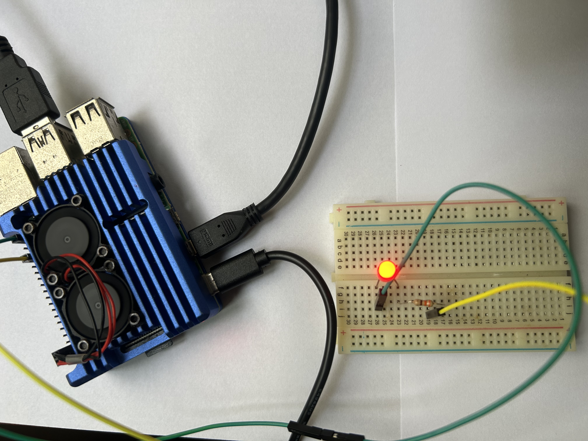

# Periph sample

This sample blinks a led using Raspberry PI's GPIOs.

This is the diagram:

.jpg)

You will need: 

- A **Raspberry PI 4 board**.
- A **330 Ohm** resistor (orange, orangem, brown).
- A **Led** of any collor. 
- A **Breadboard**.
- Some connector cables for breadboard.
- An Raspberry power source or a computer.

This is the source code from [**periph**](https://periph.io/device/led/): 

```go
package main

import (
    "log"
    "time"

    "periph.io/x/conn/v3/gpio"
    "periph.io/x/host/v3"
    "periph.io/x/host/v3/rpi"
)

func main() {
    // Load all the drivers:
    if _, err := host.Init(); err != nil {
        log.Fatal(err)
    }

    t := time.NewTicker(500 * time.Millisecond)
    for l := gpio.Low; ; l = !l {
        // Lookup a pin by its location on the board:
        if err := rpi.P1_33.Out(l); err != nil {
            log.Fatal(err)
        }
        <-t.C
    }
}
```

1. Create a module: 

```shell
go mod init <domain>/<some name>

(go mod init cleutonsampaio.com/periph)
```

2. Install dependency: 

```shell
go get periph.io/x/cmd/...
```

3. Run the application



