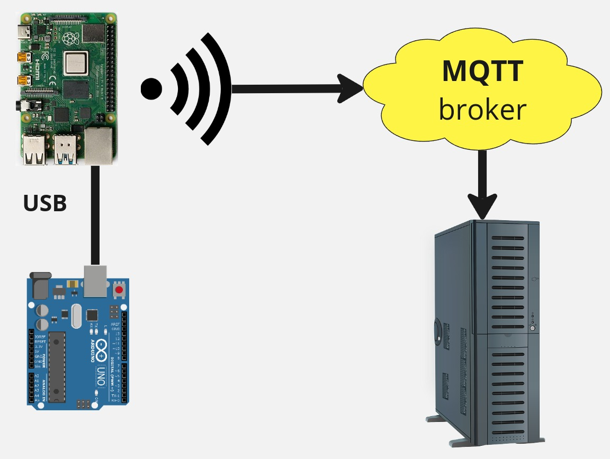
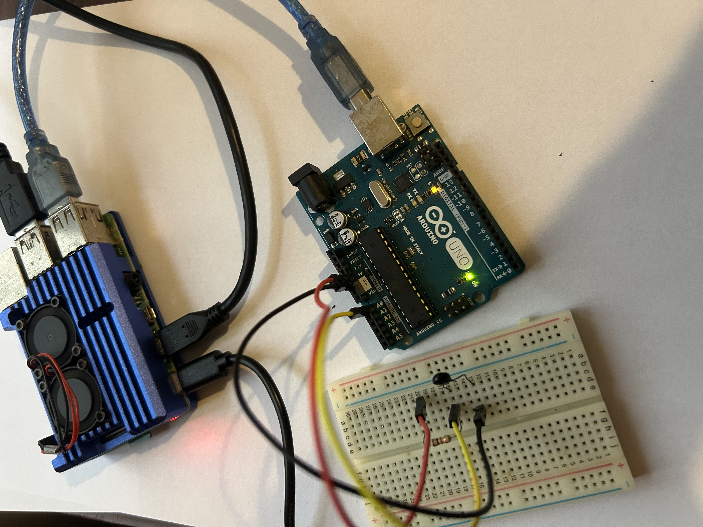
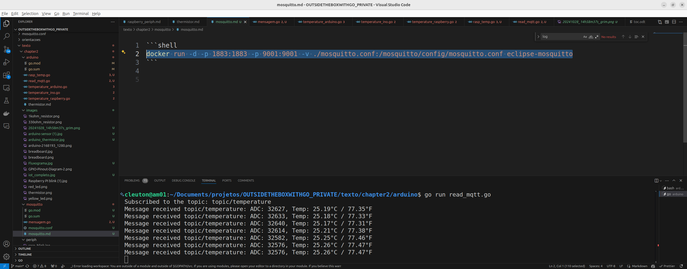

# A complete IoT project using Go

Let's build a complete **IoT** project using only **Go**. This is the diagram: 



To build this you will need: 

1. An **Arduino with the Breadboard** project setup (Thermistor)
2. A **Raspberry PI 4** Single Board Computer
3. A **MQTT broker** running

You will connect Arduino board to the Raspberry PI SBC using an usb cable. Remember to connect the Arduino board with the Breadboard [according to the project](../Embedded/arduino.md).

## MQTT server

On any computer in a network reachable by the **Raspberry PI** SBC (it can be in the cloud as well), run an **MQTT broker**. I am using **Eclipse Mosquitto** with **Docker**. I the **iot** folder here you have a `mosquitto.conf` file, which you can use to configure the **broker**: 

```shell
docker run -d -p 1883:1883 -p 9001:9001 -v ./mosquitto.conf:/mosquitto/config/mosquitto.conf eclipse-mosquitto
```

(type the above command in a single line)

## Raspberry PI

You will need to create a module and install the dependencies: 

```shell
go get github.com/tarm/serial
go get github.com/eclipse/paho.mqtt.golang
```

This is the source code for Raspberry PI: 

```go
package main

import (
	"bufio"
	"fmt"
	"log"
	"math"
	"os"
	"strings"
	"time"

	mqtt "github.com/eclipse/paho.mqtt.golang"
	"github.com/tarm/serial"
)

func main() {
	// MQTT broker configuration
	mqttBroker := "tcp://localhost:1883"
	topic := "topic/temperature"

	// MQTT connection setup
	opts := mqtt.NewClientOptions().AddBroker(mqttBroker)
	opts.SetClientID("go_mqtt_publisher")
	client := mqtt.NewClient(opts)
	if token := client.Connect(); token.Wait() && token.Error() != nil {
		log.Fatalf("Erro ao conectar ao servidor MQTT: %v", token.Error())
	}
	defer client.Disconnect(250)

	// Arduino Serial Port
	serialPort := "/dev/ttyACM0" // maybe /dev/ttyACM0 or /dev/ttyUSB0
	if len(os.Args) > 1 {
		serialPort = os.Args[1]
	}

	// Serial connection setup
	config := &serial.Config{Name: serialPort, Baud: 9600}
	s, err := serial.OpenPort(config)
	if err != nil {
		log.Fatalf("Serial port fail %s: %v", serialPort, err)
	}
	defer s.Close()

	reader := bufio.NewReader(s)

	for {
		// Read a line from serial port
		line, err := reader.ReadString('\n')
		if err != nil {
			log.Printf("Serial port read error: %v", err)
			time.Sleep(time.Second)
			continue
		}

		// Remove whitespaces and newline characters
		line = strings.TrimSpace(line)

		if line == "" {
			// Empty line? Log it and continue
			log.Println("Empty line received from serial port")
			continue
		}

		// Parse ADC value
		var adcValue uint32
		_, err = fmt.Sscanf(line, "%d", &adcValue)
		if err != nil {
			log.Printf("Error parsing ADC value '%s': %v", line, err)
			continue
		}

		// Calculate temperature
		tempCelsius := computeTemperature(adcValue)
		tempFahrenheit := tempCelsius*9/5 + 32

		// Publish temperature to MQTT topic
		text := fmt.Sprintf("ADC: %d, Temp: %.2f°C / %.2f°F", adcValue, tempCelsius, tempFahrenheit)
		token := client.Publish(topic, 0, false, text)
		token.Wait()

		fmt.Printf("Published to MQTT: %s\n", text)
	}
}

// Celsius temperature converter
func computeTemperature(adcValue uint32) float64 {
	// Constants for the Steinhart-Hart equation
	const (
		VCC    = 5.0           // Tension (V)
		R      = 1000.0        // Fixed resistor (Ohms)
		RT0    = 1000.0        // Thermistor resistir T0 (Ohms)
		T0     = 25.0 + 273.15 // Reference temperature (Kelvin)
		B      = 3977.0        // Beta coefficient (K)
		ADCMax = 65535.0       // Max ADC value (16 bits TinyGo)
	)

	// Tension on thermistor
	VRT := VCC * float64(adcValue) / ADCMax

	// Avoid division by zero
	if VRT == 0 {
		return math.NaN() // Return "Not a Number" if division by zero
	}

	// Calculate thermistor resistance
	RT := VRT * R / (VCC - VRT)

	// Calculate Kelvin temperature using Steinhart-Hart equation
	ln := math.Log(RT / RT0)
	TX := 1 / ((ln / B) + (1 / T0))

	// Convert to Celsius
	tempCelsius := TX - 273.15

	return tempCelsius
}

```

You may have problems running the above script on Raspberry PI. Use the `build` command this way: 

```shell
GOOS=linux GOARCH=arm CGO_ENABLED=0 go build 
```

This `GCO_ENABLED=0` avoids a problem with old versions. 

## Message processor

Now the final destination: The message processor. This will run in a computer that can reach the **MQTT broker**. 

You will need to create a module and install dependencies: 

```shell
go get github.com/eclipse/paho.mqtt.golang
```

This is the source code: 

```go
package main

import (
	"fmt"
	"log"

	mqtt "github.com/eclipse/paho.mqtt.golang"
)

func main() {
	// MQTT broker configuration
	mqttBroker := "tcp://localhost:1883"
	topic := "topic/temperature"

	// MQTT connection setup
	opts := mqtt.NewClientOptions().AddBroker(mqttBroker)
	opts.SetClientID("go_mqtt_subscriber")

	// Callback to process received messages
	messageHandler := func(client mqtt.Client, msg mqtt.Message) {
		fmt.Printf("Message received %s: %s\n", msg.Topic(), string(msg.Payload()))
	}

	// Callback setup
	opts.SetDefaultPublishHandler(messageHandler)

	// MQTT broker connection
	client := mqtt.NewClient(opts)
	if token := client.Connect(); token.Wait() && token.Error() != nil {
		log.Fatalf("Error connecting to MQTT broker: %v", token.Error())
	}
	defer client.Disconnect(250)

	// Topic subscription
	if token := client.Subscribe(topic, 0, nil); token.Wait() && token.Error() != nil {
		log.Fatalf("Error subscribing to the topic: %v", token.Error())
	}
	fmt.Printf("Subscribed to the topic: %s\n", topic)

	// Keep program running
	select {}
}

```

This is the running solution on **Raspberry PI**: 



This is Raspberry PI running the application and posting to MQTT: 


And this is the MQTT receiver application, running on other computer: 

